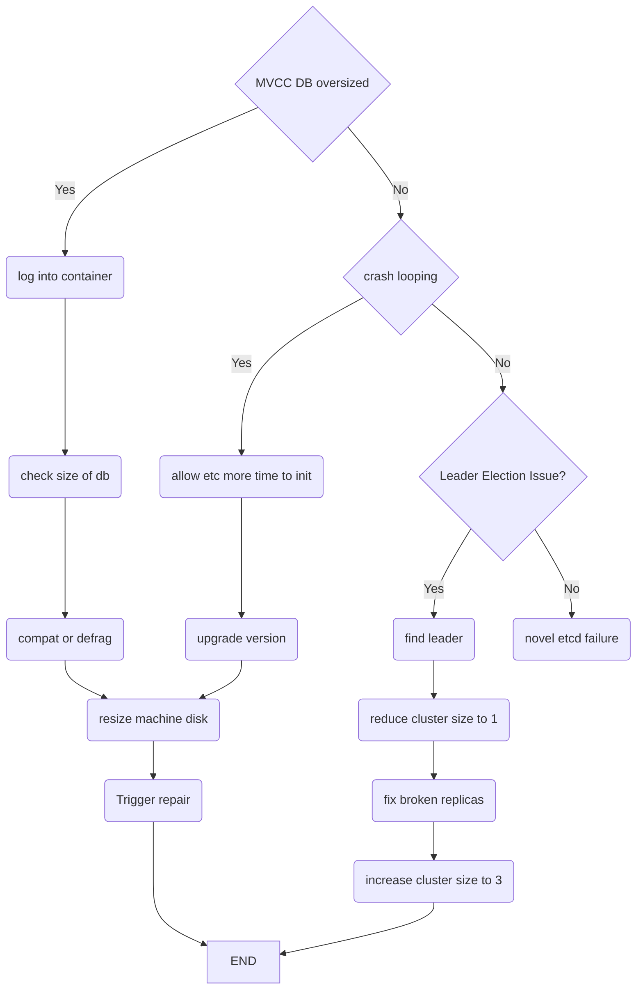

# etcd day2 operations

## How to do all the steps in the following flow chat?

```mermaid
flowchart TD
    oversized{MVCC DB oversized}-->|Yes|logIntoContainer(log into container)
    logIntoContainer --> checkSize(check size of db)
    checkSize --> compatOrDefrag(compat or defrag)
    compatOrDefrag --> resizeDisk(resize machine disk)
    resizeDisk --> triggerRepair(Trigger repair)
    triggerRepair --> END
    oversized -->|No|crashLoop{crash looping}
    crashLoop -->|Yes| moreTime2Init(allow etc more time to init)
    moreTime2Init --> upgradeVersion(upgrade version)
    upgradeVersion --> resizeDisk
    crashLoop -->|No| leaderElectionIssue{Leader Election Issue?}
    leaderElectionIssue -->|Yes| findLeader(find leader)
    findLeader --> reduceSizeTo1(reduce cluster size to 1)
    reduceSizeTo1 --> fixBrokenReplicas(fix broken replicas)
    fixBrokenReplicas --> increaseClusterSizeTo3(increase cluster size to 3)
    increaseClusterSizeTo3 --> END
    leaderElectionIssue -->|No| novelIssue(novel etcd failure)

```

## Reference

https://static.sched.com/hosted_files/kccnceu18/9a/Stories%20from%20the%20Playbook.pdf#page=5